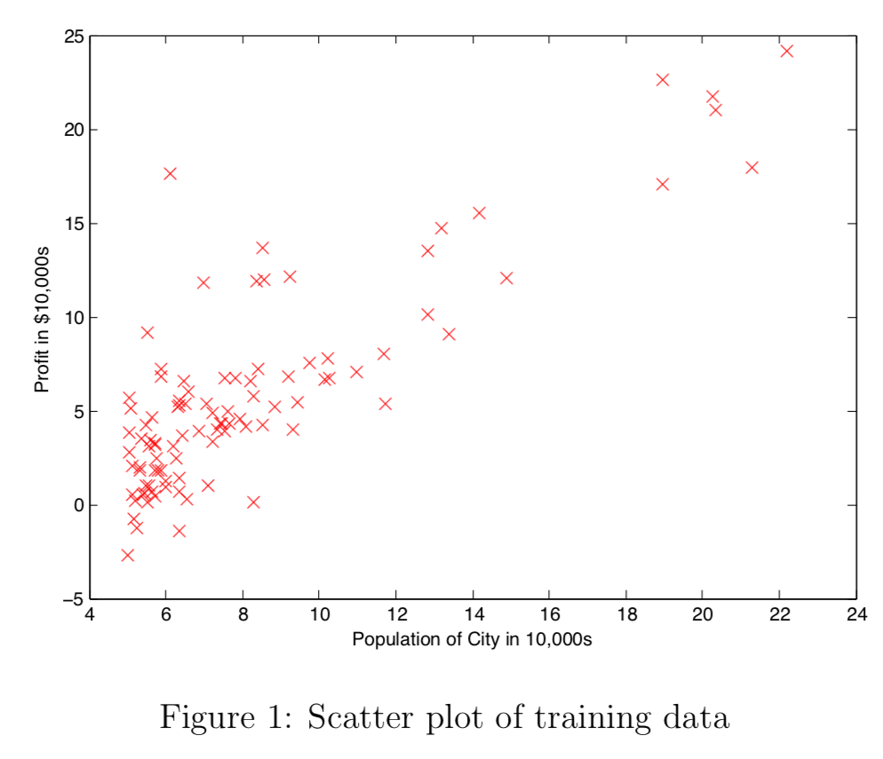

# 编程作业1：线性回归

## 引言

在这个练习中，你将实现线性回归，然后查看它如何在数据集上工作。在开始这个编程练习之前，我们强烈建议您观看视频课程并完成对应主题的测验。

首先您需要下载初始代码并将内容解压到您想要的目录，来开始本练习。如果有必要，可以在Octave/Matlab中使用cd命令切换到这个目录。

您还可以在本课程网站的“Environment Setup Instructions”中安装Octave/MATLAB的说明。

### 本练习中包含的文件

**ex1.m** - Octave/MATLAB脚本，用于指导您完成练习

**ex1_multi.m** - Octave/MATLAB脚本，用于指导您完成后半部分的练习

**ex1data1.txt** - 单变量线性回归的数据集

**ex1data2.txt** - 多变量线性回归的数据集

**submit.m** - 提交脚本将您的代码 发送到我们的服务器

**[\*] warmUpExercise.m** - Octave/MATLAB里简单的示例函数

**[\*] plotData.m** - 用于在图上显示数据集的函数

**[\*] computeCost.m** - 计算单变量线性回归代价的函数

**[\*] gradientDescent.m** - 计算单变量梯度下降的函数

**[\+] computeCostMulti.m** - 计算多变量线性回归代价的函数

**[\+] gradientDescentMulti.m** - 计算多变量的梯度下降的函数

**[\+] featureNormalize.m** - 特征归一化函数 ，表示可选的练习

**[\+] normalEqn.m** - 计算正规方程的函数

\* 表示必须完成的文件

\+ 表示可选练习


在整个练习过程中，您将使用脚本**ex1.m**和**ex1 multi.m**来检查程序。这些脚本倒入了对应问题的数据集，并调用您编写的函数。您不需要修改这两个脚本。您只需根据此脚本提供的指令修改其他文件中的函数。

只需要完成编程练习的第一部分，就可以实现单变量线性回归。而练习的第二部分是可选的，它用于实现多变量线性回归。

### 获取帮助

本课程的练习使用Octave（Octave是MATLAB的免费替代品。对于此编程练习，你可以任意使用Octave或MATLAB）或Matlab来完成，这是一个适于数值计算的高级语言。如果您没有安装Octave或MATLAB，请参考课程网站的“Environment Setup Instructions”中的安装说明。

在Octave/Matlab命令行中，键入**help**，后面输入一个函数名称，可以显示内置函数的文档。例如，**help plot**将显示关于绘图的帮助信息。Octave的详细文档可以在[Octave文档页](http://www.gnu.org/software/octave/doc/interpreter/)中找到。Matlab的详细文档可以在[Matlab文档页](http://www.mathworks.com/help/matlab/?refresh=true)找到。

我们还强烈鼓励使用在线讨论与其他学生讨论编程练习。但是，不要剽窃其他人编写的源代码，也不要与其他人共享源代码。

---

## 1 简单的Octav/Matlab函数

**ex1.m**的第一部分让你练习Octave/Matlab语法以及提交作业的过程。在文件**warmUpExercise.m**中，你会找到一个Octave/Matlab函数的框架。修改它，填写以下代码以返回一个5×5的单位矩阵：

```matlab
A = eye(5);
```

完成后，运行**ex1.m**（切换到对应目录之后，在Octave/MATLAB命令框中键入“**ex1**”），您应该会看到类似于以下内容的输出：

```matlab
ans＝
Diagonal Matrix
1  0  0  0  0
0  1  0  0  0
0  0  1  0  0
0  0  0  1  0
0  0  0  0  1
```

现在**ex1.n**将暂停，按下任意键，然后运行代码的下一部分。如果您希望退出，键入**ctrl-c**可以在运行期间停止程序。

### 1.1 提交解答

完成练习的一部分后，你可以在Octave/Matlab命令行输入**submit**的提交解答。提交脚本会提示您输入账户邮箱和token，并询问您想提交哪些文件。您可以从此练习的网页中获取token。

*现在你应该提交你的解答。*

您可以反复提交您的解答，我们将只参考最高得分。

---

## 2 单变量线性回归
在这部分练习中，你将实现一个单变量线性回归，用来预测食品车的利润。假设你是餐厅公司的CEO，正在考虑在不同的城市开设新的销售渠道。目前在各个城市都已有食品车运营，你可以获得这些城市对应的利润和人口数据。

您希望使用这些数据来帮助您选择下一个扩展业务的城市。

文件**ex1data1.txt**包含了解决我们线性回归问题的数据集。第一列是一个城市的人口，第二列是该城的一辆食品车的利润。利润的负值表示亏损。

**ex1.m**脚本已经为你加载了这些数据。

### 2.1 绘制数据
在开始练习之前，通过将数据可视化来了解数据是很有用的。对于这个数据集，可以使用散点图来可视化数据，因为它只有两个属性可以绘制（利润和人口）。（你在现实生活中遇到的许多其他问题都是多维的，所以不能被绘制在二维图上。）

在**ex1.m**中，数据集从数据文件加载到变量**X**和***y***中：

```matlab
data = load('ex1data1.txt');       % read comma separated data
X = data(:, 1); y = data(:, 2);
m = length(y);                     % number of training examples
```

接下来，脚本调用**plotData**函数来创绘制数据的散点图。您的任务是完成**plotData.m**来绘制图像；修改文件并填写以下代码：

```matlab
plot(x, y, 'rx', 'MarkerSize', 10); % Plot the data
ylabel('Profit in $10,000s'); % Set the y−axis label
xlabel('Population of City in 10,000s'); % Set the x−axis label
```

现在，当您继续运行**ex1.m**时，得到的最终结果应该类似于Figure 1，并且红色“X”标记和坐标轴的标签应该相同。

要了解关于绘图命令的更多信息，可以在Octave/MATLAB命令提示符处键入**help plot**，或者在网络上搜索文档。（为了将标记更改为红色“x”，我们在plot中使用选项“rx”，即，**plot( . . , [your options here], . . , ‘rx’);**）



### 2.2 梯度下降
在这部分中，你将使用梯度下降法拟合线性回归参数$\theta$到数据集。
#### 2.2.1 更新方程
线性回归的目的是最小化代价函数。
$$
J(\theta) = \frac{1}{2m} \sum^m_{i=1}(h_{\theta}(x^{(i)}-y^{(i)})^2)
$$
假设函数$h_{theta}(x)$由线性模型给出
$$
h_{\theta}(x) = \theta^T x = \theta_0 + \theta_1 x_1
$$


回想一下，你将调整模型的参数是$\theta_j$，以最小化代价函数$J(\theta)$的值。其中一种实现它的方法是使用梯度下降算法。在梯度下降中，每次迭代都要执行更新
$$
\theta_j := \theta_j - \alpha \frac{1}{m} \sum^m_{i=1}(h_{\theta}(x^{(i)})-y^{(i)})x^{(i)}_j
(对于所有j,同步更新\theta_j)
$$
每执行一步梯度下降，你的参数$\theta_j$就越接近是代价函数$J(\theta)$最小的最优值。


